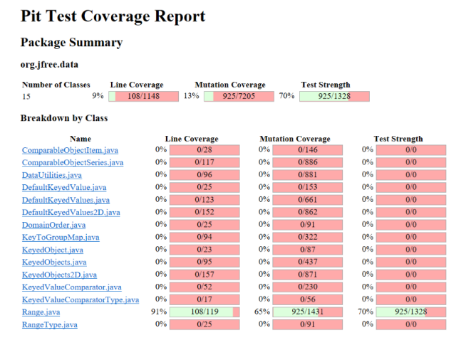
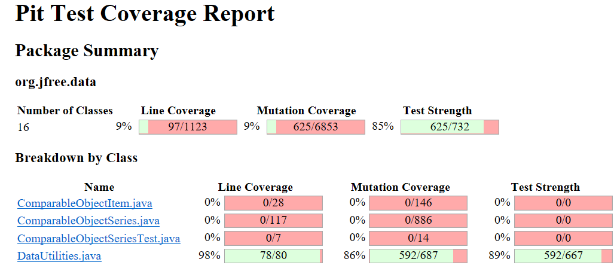
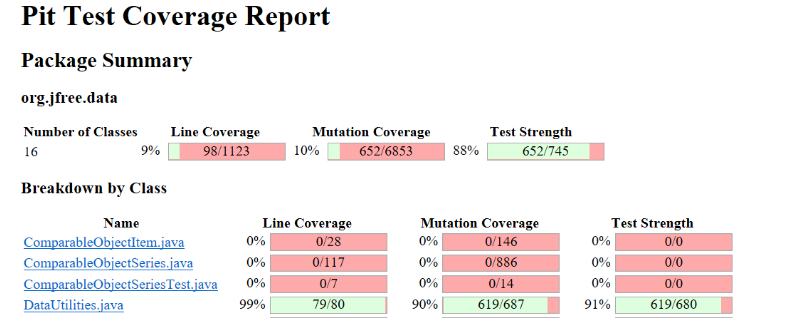
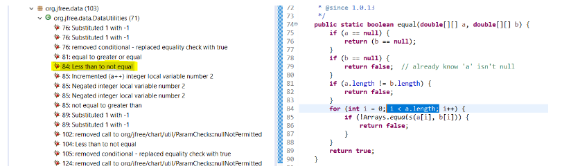
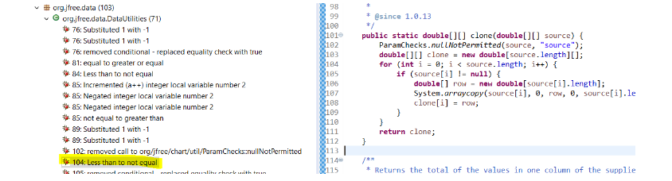

**SENG 438 - Software Testing, Reliability, and Quality**

**Lab. Report \#4 – Mutation Testing and Web app testing**

| Group \#:      | 23    |
| -------------- | --- |
| Student Names: |   Mustafa Muhammad  |
|                |   Samuel Tomocek  |
|                |   Umair Tariq  |
|                |   Gian Luke Adug  |

# Introduction

# Analysis of 10 Mutants of the Range class 

# Report all the statistics and the mutation score for each test class

Range Class:
Before:

After: 

DataUtilities Class:

Before: 

After:

<b> Note: Our DataUtility class had such a strong mutation score to begin with, and when looking into the surviving mutations most of which were equivalent mutants or straight up incorrect mutants. Thus we opted for increasing the mutation score as much as we could, which ended up being 4%. This is due to us having 62 working tests from the last lab, in which we were attempting to get 90% line coverage, 70% branch coverage and 60% method coverage. However we ended up overshooting and increasing the coverage to higher then expected amount, leading to a very robust and strong test suite which worked against us for this lab. Thus the rest of the work was spent on the range class. </b>

# Analysis drawn on the effectiveness of each of the test classes

Range Class:
We added many test cases to the Range class to improve the overall coverage that was put out for this assignment. We initially had a coverage of about 65% so the test cases would need to be effective enough to increase the amount. For the intersects method we added a total of 9 more test cases that targeted the specific mutants associated with that method. For the equals method we added a total of 6 more test cases that targeted the specific mutants associated with that method. For the constrain method we added a total of 5 more test cases that targeted the specific mutants associated with that method. For the hashcode method we added a total of 2 more test cases that targeted the specific mutants associated with that method. Covering just these 4 methods alone increased the overall mutation coverage score by about 6% which is a decent increase and the effectiveness of the test cases is demonstrated as such.

DataUtilities Class:
Similarly many test cases were added to the DataUtilities class to improve the mutation coverage. The initial mutation coverage for this class was a strong 86%, meaning it might be impossible to increase to 96% due to certain types of mutations which cannot be killed. Thus we opted to increase it as much as we could, which led to 90% coverage.  The methods focused on were methods which had mutations that were easily spotted as a red flag. One of the most improved methods is the CalculateColumnTotal method, which had an issue of not testing column indices which were at the boundaries of the input data matrix. Around 14 new tests were made to combat the surviving mutants.

# A discussion on the effect of equivalent mutants on mutation score accuracy

The presence of equivalent mutants in the mutant set would decrease the mutation score because the denominator (total number of mutants) would increase, but the numerator (number of mutants killed) would not change since equivalent mutants cannot be killed by test cases.
Our process to find a few equivalent mutants involved investigating the mutation logs to see which mutations survived. Then looked through each surviving mutant, and the source code which that mutant changed then verifying that this mutant did not change the way the source code acted in that situation. An example of this is shown below: 

Here this surviving mutant changed the for loop from a less than operator to a not equal operator. Upon inspecting the code manually, our team determined that this would not affect the source code in any way and thus is an equivalent mutant. One more equivalent mutant detected is shown below: 

# A discussion of what could have been done to improve the mutation score of the test suites

Our design strategy focused on first seeing how many of our mutations were killed and how many survived. After this we analyzed specifically on the mutations that survived and tried to locate where most of them were concentrated. If there were many on the same line then that means those methods required more test cases and could be much more helpful in helping us reach a higher mutation coverage. For instance we noticed that there were a lot of mutations concentrated primarily on the line 183 and this was for the method intersects(), therefore this became one of our primary suspects in investigating the code harder and reinvigorating our test cases. Then when we went into our test cases we examined what could possibly increase the mutation coverage while also being mindful of the equivalent mutants. Analyzing where there were equivalent mutants was also an important step in the design of our test strategy as those that had them were seen as less important and we focused our time on more important test cases. Lastly we looked back at our test cases and examined where there were not that many test cases, for instance in hashcode we only had 1 test case, therefore this made it a primary candidate to look for mutants and we then added 2 more test cases by the end to increase the overall mutation coverage. We carried out this strategy to increase the mutation coverages throughout the assignment.

# Why do we need mutation testing? Advantages and disadvantages of mutation testing

We need mutation testing to verify the quality of our tests. By adding small changes to the code, we can analyze whether our tests are able to identify these changes. This ensures that the tests are specific and test the code comprehensively. Advantages of mutation testing include ensuring the quality of our tests, and improving the quality of the code that we are testing. By ensuring the quality of our tests with thorough testing, that leads to finding faults in our code, and hence gives an opportunity to fix our code. Disadvantages of mutation testing includes the fact that it is very time consuming. Both increasing the mutation score, and running the mutation tests themselves is tedious. 

# Explain your SELENUIM test case design process

For our Selenium test cases we first started by looking at the website in question. For our case we decided to test amazon’s website. Before getting into the actual testing, we investigated the functionality of the site itself, and pinpointed common actions which a user would take. We then manually ran through each of the common actions iteratively to mock how the test should act. Finally we downloaded the chrome extension Selenium IDE for ease of use. We then recorded each of our two tests, using the IDE to generate the test for us. Finally we edited the generated test case to add any functionality needed to complete the test such as assertions or wait functions to wait for an element to appear on the page. 

# Explain the use of assertions and checkpoints

Assertions are used to determine whether the result received was the expected result. This ensures that the desired output of the application is maintained. Assertions are used to check if a test has passed or failed. Checkpoints are used to periodically check whether the current state of the application is correct. This also leads to the result that checkpoints ensure that the GUI elements are all functioning as intended. This would include elements such as buttons and links.

# how did you test each functionaity with different test data

# Discuss advantages and disadvantages of Selenium vs. Sikulix

One clear advantage of Selenium is that it installs better as a browser web extension (at least if you use Google Chrome) and this makes the process much easier to begin as some development tools can get very hectic with their installations. On the other hand Sikulix was not too bad of an installation either but Selenium is clearly better in this regard. Another disadvantage of Sikulix is that the overall design makes it a lot more difficult to work with, as the graphical user interface does look fairly dated whereas Selenium is minimalist and very simple in its design which is a great thing for user-friendly activity. The ability to export to multiple different testing libraries was also extremely quick and far simpler than Sikulix. However, that doesn’t mean Sikulix is only faults as it has some advantages as well. One advantage of Sikulix that we noted during our testing was that it was overall more stable. On Selenium we had more occasions of the IDE freezing than we did using Sikulix. Another clear advantage of Sikulix is that it can automate flash objects much easier. Sikulix can also handle applications from our desktop whereas Selenium is fairly limited to just web browser applications. Sikulix can also handle multiple apps whereas on Selenium you can only have your single web browser up for testing. Overall they have their advantages and disadvantages and if testing is needed solely for web development then Selenium is a great choice and for desktop applications Sikulix is great.   

# How the team work/effort was divided and managed

# Difficulties encountered, challenges overcome, and lessons learned

This lesson taught us the basics for mutation and GUI testing!

During the Selenium testing one difficulty we encountered was that for testing fields that are blank, you should not leave the field blank. This is because Selenium relies on the user inputting “” for blank statements otherwise the test file will not export.

# Comments/feedback on the lab itself

Overall the lab was a great learning experience and provided us a lot of insight into the details of mutations and web-based testing. Feedback regarding the lab pertains to better installation instructions for Selenium as the overall process was fairly simple but we were told to do it ourselves, which is not a bad thing but a quick 3 step installation instruction process would’ve also been great.
